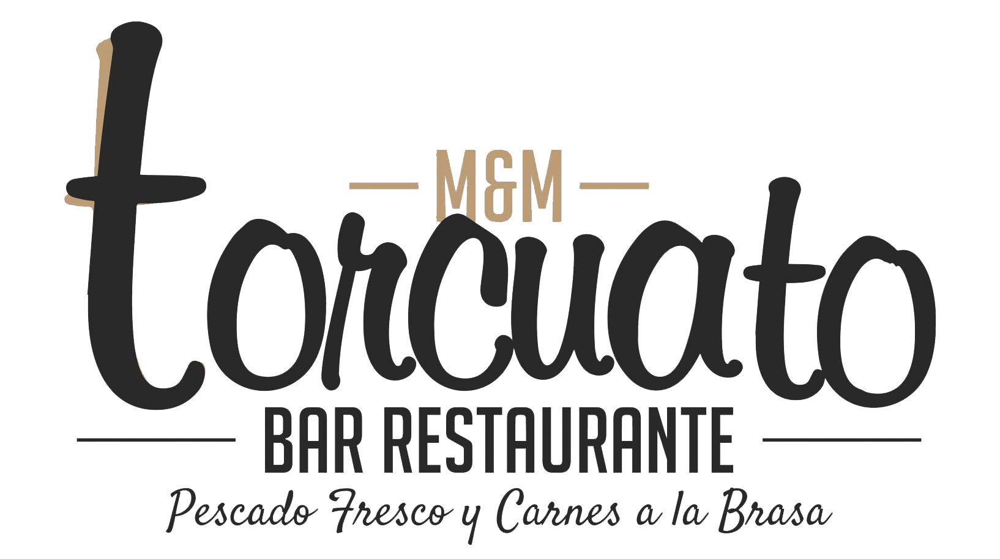

# WebRestaurante
<h1 align="center">
  
    
  Bar-Restaurante Torcuato</h1>
Este es el proyecto realizado para fin de ciclo de Grado Superior de Desarrollo de Aplicaciones Web. 
<h2><b>IMPORTANTE</b></h2>
 
La Web esta subida a un servidor gratuito como es 000webhost por la tanto la función de enviar correos esta capada para que la gente no lo use para mandar spam. Para ver su correcto funcionamiento, debes descargar el proyecto y abrirlo con XAMPP
 
<h2><b>Codigo QR</b></h2>
 

